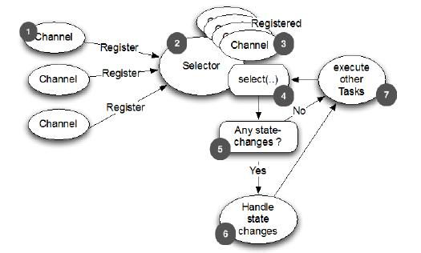
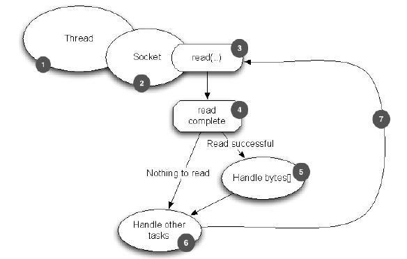

# 基于传输的API

|      方法名称      |                        描述                         |
| :----------------: | :-------------------------------------------------: |
|    eventLoop()     |            返回分配给Channel的EventLoop             |
|     pipeline()     |         返回分配给Channel的ChannelPipeline          |
|     isActive()     |    返回Channel是否激活，已激活说明与远程连接对等    |
|   localAddress()   |            返回已绑定的本地SocketAddress            |
|  remoteAddress()   |            返回已绑定的远程SocketAddress            |
|      write()       | 写数据到远程客户端，数据通过ChannelPipeline传输过去 |
|      flush()       |                   刷新先前的数据                    |
| writeAndFlush(...) |  一个方便的方法用户调用write(...)而后调用y flush()  |

## NIO-Nonblocking I/O

NIO 中，我们可以注册一个通道或获得某个通道的改变的状态，通道状态有下面几种改变：

- 一个新的 Channel 被接受并已准备好
- Channel 连接完成
- Channel 中有数据并已准备好读取
- Channel 发送数据出去

处理完改变的状态后需重新设置他们的状态，用一个线程来检查是否有已准备好的 Channel，如果有则执行相关事件。在这里可能只同时一个注册的事件而忽略其他的。选择器所支持的操作在 SelectionKey 中定义，具体如下：

Table 4.2 Selection operation bit-set

|  方法名称  |                   描述                   |
| :--------: | :--------------------------------------: |
| OP_ACCEPT  |            有新连接时得到通知            |
| OP_CONNECT |            连接完成后得到通知            |
|   OP_REA   |         准备好读取数据时得到通知         |
|  OP_WRITE  | 写入更多数据到通道时得到通知，大部分时间 |

这是可能的，但有时 socket 缓冲区完全填满了。这通常发生在你写数据的速度太快了超过了远程节点的处理能力。

1.新信道注册 WITH 选择器

2.选择处理的状态变化的通知

3.以前注册的通道

4.Selector.select（）方法阻塞，直到新的状态变化接收或配置的超时已过

5.检查是否有状态变化

6.处理所有的状态变化

7.在选择器操作的同一个线程执行其他任务

## OIO-Old blocking I/O

Netty利用了`SO_TIMEOUT`标志，可以设置在一个Socket。这`timeout`　指定最大毫秒数量用于等待I/O的操作完成。如果操作在指定的时间内失败，SocketTimeoutException会被抛出。 Netty中捕获该异常并继续处理循环。在接下来的事件循环运行，它再次尝试。像Netty的异步架构来支持OIO的话，这其实是唯一的办法。当SocketTimeoutException抛出时，执行stack trace。

1.线程分配给 Socket

2.Socket 连接到远程

3.读操作（可能会阻塞）

4.读完成

5.处理可读的字节

6.执行提交到 socket 的其他任务

7.再次尝试读