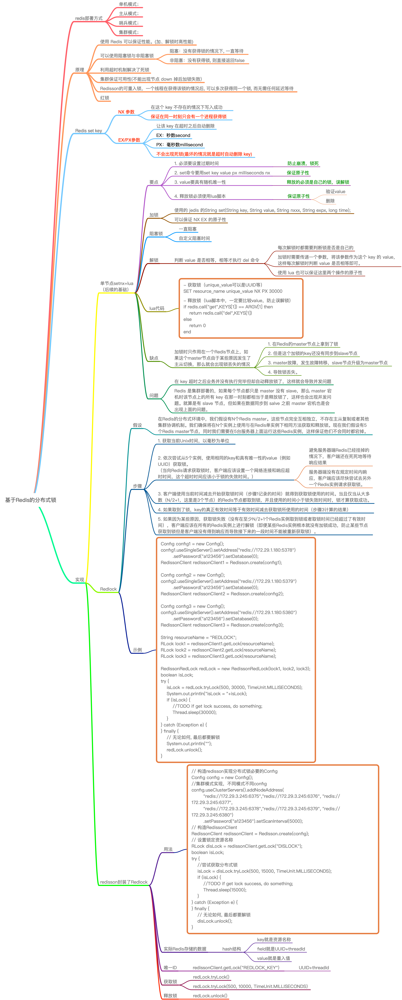

# 基于Redis的分布式锁

<!-- @import "[TOC]" {cmd="toc" depthFrom=2 depthTo=6 orderedList=false} -->
<!-- code_chunk_output -->

* [思维导图](#思维导图)
* [前言](#前言)
* [Redis Set](#redis-set)
	* [加锁](#加锁)
		* [阻塞锁](#阻塞锁)
	* [解锁](#解锁)
* [引用](#引用)

<!-- /code_chunk_output -->

## 思维导图



## 前言

分布式锁在分布式应用中应用广泛，想要搞懂一个新事物首先得了解它的由来，这样才能更加的理解甚至可以举一反三。

首先谈到分布式锁自然也就联想到分布式应用。

在我们将应用拆分为分布式应用之前的单机系统中，对一些并发场景读取公共资源时如扣库存，卖车票之类的需求可以简单的使用[同步](https://crossoverjie.top/2018/01/14/Synchronize/)或者是[加锁](https://crossoverjie.top/2018/01/25/ReentrantLock/)就可以实现。

但是应用分布式了之后系统由以前的单进程多线程的程序变为了多进程多线程，这时使用以上的解决方案明显就不够了。

因此业界常用的解决方案通常是借助于一个第三方组件并利用它自身的排他性来达到多进程的互斥。如：

- 基于 DB 的唯一索引。
- 基于 ZK 的临时有序节点。
- 基于 Redis 的 `NX EX` 参数。

这里主要基于 Redis 进行讨论。

---

## Redis Set

```redis
SET key value [EX seconds] [PX milliseconds] [NX|XX]
```

- `EX second` ：设置键的过期时间为 `second` 秒。 `SET key value EX second` 效果等同于 `SETEX key second value` 。
- `PX millisecond` ：设置键的过期时间为 `millisecond` 毫秒。 `SET key value PX millisecond` 效果等同于 `PSETEX key millisecond value` 。
- `NX` ：只在键不存在时，才对键进行设置操作。 `SET key value NX` 效果等同于 `SETNX key value` 。
- `XX` ：只在键已经存在时，才对键进行设置操作。

> EX和PX同时存在时，后者覆盖前者

```sh
# EX 和 PX 可以同时出现，但后面给出的选项会覆盖前面给出的选项

redis 127.0.0.1:6379> SET key "value" EX 1000 PX 5000000
OK

redis 127.0.0.1:6379> TTL key
(integer) 4993  # 这是 PX 参数设置的值

redis 127.0.0.1:6379> SET another-key "value" PX 5000000 EX 1000
OK

redis 127.0.0.1:6379> TTL another-key
(integer) 997   # 这是 EX 参数设置的值
```


---

既然是选用了 Redis，那么它就得具有排他性才行。同时它最好也有锁的一些基本特性：

- 高性能(加、解锁时高性能)
- 可以使用阻塞锁与非阻塞锁。
- 不能出现死锁。
- 可用性(不能出现节点 down 掉后加锁失败)。

这里利用 `Redis set key` 时的一个 NX 参数可以保证在这个 key 不存在的情况下写入成功。并且再加上 EX 参数可以让该 key 在超时之后自动删除。

所以利用以上两个特性可以保证在同一时刻只会有一个进程获得锁，并且不会出现死锁(最坏的情况就是超时自动删除 key)。

### 加锁

实现代码如下：

```java
private static final String SET_IF_NOT_EXIST = "NX";
private static final String SET_WITH_EXPIRE_TIME = "PX";

public  boolean tryLock(String key, String request) {
    String result = this.jedis.set(LOCK_PREFIX + key, request, SET_IF_NOT_EXIST, SET_WITH_EXPIRE_TIME, 10 * TIME);

    if (LOCK_MSG.equals(result)){
        return true ;
    }else {
        return false ;
    }
}
```

注意这里使用的 jedis 的

```java
String set(String key, String value, String nxxx, String expx, long time);
```

api。

该命令可以保证 NX EX 的原子性。

一定不要把两个命令(NX EX)分开执行，如果在 NX 之后程序出现问题就有可能产生死锁。

#### 阻塞锁

同时也可以实现一个阻塞锁：

```
//一直阻塞
public void lock(String key, String request) throws InterruptedException {

    for (;;){
        String result = this.jedis.set(LOCK_PREFIX + key, request, SET_IF_NOT_EXIST, SET_WITH_EXPIRE_TIME, 10 * TIME);
        if (LOCK_MSG.equals(result)){
            break ;
        }

 //防止一直消耗 CPU
        Thread.sleep(DEFAULT_SLEEP_TIME) ;
    }

}

 //自定义阻塞时间
 public boolean lock(String key, String request,int blockTime) throws InterruptedException {

    while (blockTime >= 0){

        String result = this.jedis.set(LOCK_PREFIX + key, request, SET_IF_NOT_EXIST, SET_WITH_EXPIRE_TIME, 10 * TIME);
        if (LOCK_MSG.equals(result)){
            return true ;
        }
        blockTime -= DEFAULT_SLEEP_TIME ;

        Thread.sleep(DEFAULT_SLEEP_TIME) ;
    }
    return false ;
}
```

### 解锁

解锁也很简单，其实就是把这个 key 删掉就万事大吉了，比如使用 `del key` 命令。

但现实往往没有那么 easy。

如果进程 A 获取了锁设置了超时时间，但是由于执行周期较长导致到了超时时间之后锁就自动释放了。这时进程 B 获取了该锁执行很快就释放锁。这样就会出现进程 B 将进程 A 的锁释放了。

所以最好的方式是在每次解锁时都需要判断锁**是否是自己**的。

这时就需要结合加锁机制一起实现了。

加锁时需要传递一个参数，将该参数作为这个 key 的 value，这样每次解锁时判断 value 是否相等即可。

所以解锁代码就不能是简单的 `del`了。

```
public  boolean unlock(String key,String request){
    //lua script
    String script = "if redis.call('get', KEYS[1]) == ARGV[1] then return redis.call('del', KEYS[1]) else return 0 end";

    Object result = null ;
    if (jedis instanceof Jedis){
        result = ((Jedis)this.jedis).eval(script, Collections.singletonList(LOCK_PREFIX + key), Collections.singletonList(request));
    }else if (jedis instanceof JedisCluster){
        result = ((JedisCluster)this.jedis).eval(script, Collections.singletonList(LOCK_PREFIX + key), Collections.singletonList(request));
    }else {
        //throw new RuntimeException("instance is error") ;
        return false ;
    }

    if (UNLOCK_MSG.equals(result)){
        return true ;
    }else {
        return false ;
    }
}
```

这里使用了一个 `lua` 脚本来判断 value 是否相等，相等才执行 del 命令。

使用 `lua` 也可以保证这里两个操作的原子性。

因此上文提到的四个基本特性也能满足了：

- 使用 Redis 可以保证性能。
- 阻塞锁与非阻塞锁见上文。
- 利用超时机制解决了死锁。
- Redis 支持集群部署提高了可用性。

## 引用

[基于 Redis 的分布式锁](https://crossoverjie.top/2018/03/29/distributed-lock/distributed-lock-redis/)

[Redlock：Redis分布式锁最牛逼的实现](https://mp.weixin.qq.com/s?__biz=MzU5ODUwNzY1Nw==&mid=2247484155&idx=1&sn=0c73f45f2f641ba0bf4399f57170ac9b&scene=21)

[Redisson实现Redis分布式锁的N种姿势](https://www.javazhiyin.com/29459.html)

## 基于Redis的分布锁到底安全吗？

[基于Redis的分布锁到底安全吗？(上)](http://zhangtielei.com/posts/blog-redlock-reasoning-part1.html)

[基于Redis的分布锁到底安全吗？(下)](http://zhangtielei.com/posts/blog-redlock-reasoning-part2.html)