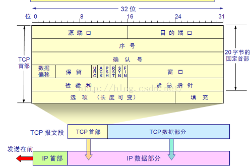

# TCP首部

1、第一个4字节：
（1）源端口，16位；发送数据的源进程端口
（2）目的端口，16位；接收数据的进程端口
2、第二个4字节与第三个4字节
（1）序号，32位；代表当前TCP数据段第一个字节占整个字节流的相对位置；
（2）确认号，32位；代表接收端希望接收的数据序号，为上次接收到数据报的序号+1，当ACK标志位为1时才生效。
3、第四个4字节：
（1）数据偏移，4位；实际代表TCP首部长度，最大为60字节。
（2）6个标志位，每个标志位1位；
SYN，为同步标志，用于数据同步；
ACK，为确认序号，ACK=1时确认号才有效；
FIN，为结束序号，用于发送端提出断开连接；
URG，为紧急序号，URG=1是紧急指针有效；
PSH，指示接收方立即将数据提交给应用层，而不是等待缓冲区满；
RST，重置连接。
（3）窗口值，16位；标识接收方可接受的数据字节数。详解可参看：http://www.cnblogs.com/woaiyy/p/3554182.html
4、第五个4字节
（1）校验和，16位；用于检验数据完整性。
（2）紧急指针，16位；只有当URG标识位为1时，紧急指针才有效。紧急指针的值与序号的相加值为紧急数据的最后一个字节位置。用于发送紧急数据。