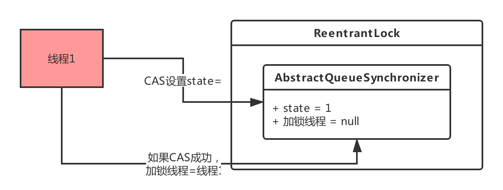

# AQS

**AbstractQueuedSynchronizer，抽象队列同步器**

ReentrantLock、ReentrantReadWriteLock底层都是基于AQS来实现的。

## ReentrantLock加锁和释放锁的底层原理

### 加锁

ReentrantLock内部包含了一个AQS对象，也就是AbstractQueuedSynchronizer类型的对象。

- 这个AQS对象内部有一个核心的变量叫做**state**，是int类型的，代表了**加锁的状态**。初始状态下，这个state的值是0

- 这个AQS内部还有一个**关键变量**，用来记录**当前加锁的是哪个线程**，初始化状态下，这个变量是null

接着线程跑过来调用ReentrantLock的lock()方法尝试进行加锁，这个加锁的过程，直接就是用CAS操作将state值从0变为1。

一旦线程1加锁成功了之后，就可以设置当前加锁线程是自己。所以大家看下面的图，就是线程1跑过来加锁的一个过程。

每次线程1可重入加锁一次，会判断一下当前加锁线程就是自己，那么他自己就可以可重入多次加锁，每次加锁就是把state的值给累加1，别的没啥变化。

说白了，就是**并发包里的一个核心组件，里面有state变量、加锁线程变量等核心的东西，维护了加锁状态**。

ReentrantLock这种东西只是一个外层的API，**内核中的锁机制实现都是依赖AQS组件的**。

### 锁的互斥是如何实现的？

AQS内部还有一个**等待队列**，专门放那些加锁失败的线程！

线程2跑过来一下看到，哎呀！state的值不是0啊？所以CAS操作将state从0变为1的过程会失败，因为state的值当前为1，说明已经有人加锁了！

接着线程2会看一下，是不是自己之前加的锁啊？当然不是了，**“加锁线程”**这个变量明确记录了是线程1占用了这个锁，所以线程2此时就是加锁失败。

### 释放锁

- 将AQS内的**state变量的值递减1**，如果state值为0，则彻底释放锁，会将“加锁线程”变量也设置为null！

- 会从**等待队列的队头唤醒线程2重新尝试加锁**

