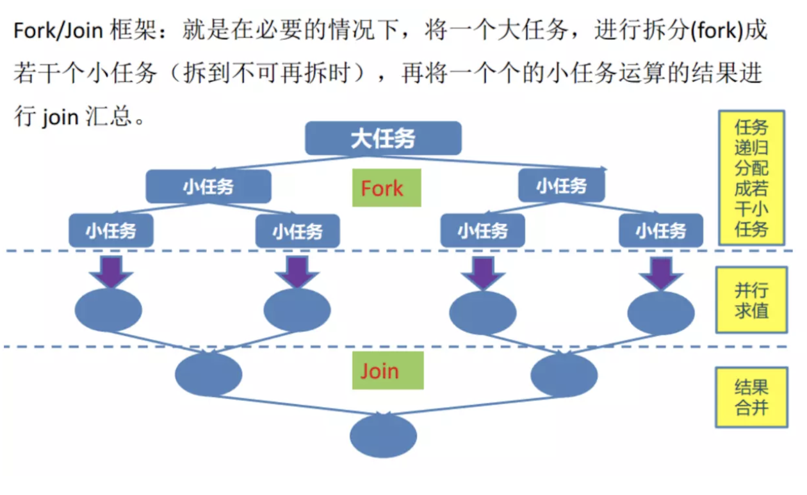
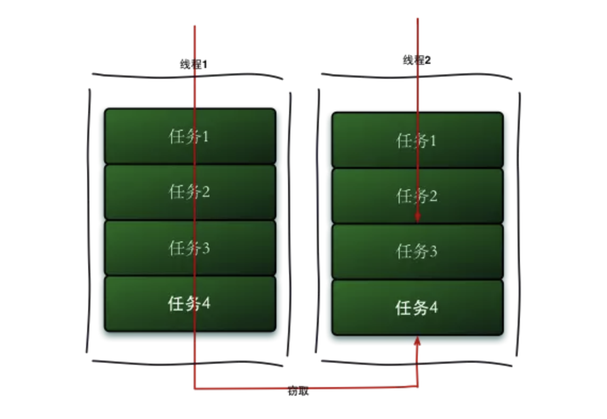

# 并行化
<!-- @import "[TOC]" {cmd="toc" depthFrom=2 depthTo=6 orderedList=false} -->
<!-- code_chunk_output -->

* [1. CountDownLatch/Phaser](#1-countdownlatchphaser)
* [2. CompletableFuture](#2-completablefuture)
* [3. Fork/Join](#3-forkjoin)
* [4. parallelStream](#4-parallelstream)
* [5. 分片](#5-分片)
* [6. 注意事项](#6-注意事项)

<!-- /code_chunk_output -->
##  1. CountDownLatch/Phaser

CountDownLatch，可以将其看成是一个计数器，await()方法可以阻塞至超时或者计数器减至0，其他线程当完成自己目标的时候可以减少1，利用这个机制我们可以将其用来做并发。

```java
public class CountDownTask {
    private static final int CORE_POOL_SIZE = 4;
    private static final int MAX_POOL_SIZE = 12;
    private static final long KEEP_ALIVE_TIME = 5L;
    private final static int QUEUE_SIZE = 1600;

    protected final static ExecutorService THREAD_POOL = new ThreadPoolExecutor(CORE_POOL_SIZE, MAX_POOL_SIZE,
            KEEP_ALIVE_TIME, TimeUnit.SECONDS, new LinkedBlockingQueue<>(QUEUE_SIZE));
    public static void main(String[] args) throws InterruptedException {
        // 新建一个为5的计数器
        CountDownLatch countDownLatch = new CountDownLatch(5);
        OrderInfo orderInfo = new OrderInfo();
        THREAD_POOL.execute(() -> {
            System.out.println("当前任务Customer,线程名字为:" + Thread.currentThread().getName());
            orderInfo.setCustomerInfo(new CustomerInfo());
            countDownLatch.countDown();
        });
        THREAD_POOL.execute(() -> {
            System.out.println("当前任务Discount,线程名字为:" + Thread.currentThread().getName());
            orderInfo.setDiscountInfo(new DiscountInfo());
            countDownLatch.countDown();
        });
        THREAD_POOL.execute(() -> {
            System.out.println("当前任务Food,线程名字为:" + Thread.currentThread().getName());
            orderInfo.setFoodListInfo(new FoodListInfo());
            countDownLatch.countDown();
        });
        THREAD_POOL.execute(() -> {
            System.out.println("当前任务Tenant,线程名字为:" + Thread.currentThread().getName());
            orderInfo.setTenantInfo(new TenantInfo());
            countDownLatch.countDown();
        });
        THREAD_POOL.execute(() -> {
            System.out.println("当前任务OtherInfo,线程名字为:" + Thread.currentThread().getName());
            orderInfo.setOtherInfo(new OtherInfo());
            countDownLatch.countDown();
        });
        countDownLatch.await(1, TimeUnit.SECONDS);
        System.out.println("主线程："+ Thread.currentThread().getName());
    }
}
```

建立一个线程池(具体配置根据具体业务，具体机器配置)，进行并发的执行我们的任务(生成用户信息，菜品信息等)，最后利用await方法阻塞等待结果成功返回。

## 2. CompletableFuture

什么是Future：用来代表异步结果，并且提供了检查计算完成，等待完成，检索结果完成等方法。

将每个任务的计算完成的结果都用CompletableFuture来表示，利用CompletableFuture.allOf汇聚成一个大的CompletableFuture，那么利用get()方法就可以阻塞。

```java
public class CompletableFutureParallel {
    private static final int CORE_POOL_SIZE = 4;
    private static final int MAX_POOL_SIZE = 12;
    private static final long KEEP_ALIVE_TIME = 5L;
    private final static int QUEUE_SIZE = 1600;

    protected final static ExecutorService THREAD_POOL = new ThreadPoolExecutor(CORE_POOL_SIZE, MAX_POOL_SIZE,
            KEEP_ALIVE_TIME, TimeUnit.SECONDS, new LinkedBlockingQueue<>(QUEUE_SIZE));
    public static void main(String[] args) throws InterruptedException, ExecutionException, TimeoutException {
        OrderInfo orderInfo = new OrderInfo();
        //CompletableFuture 的List
        List<CompletableFuture> futures = new ArrayList<>();
        futures.add(CompletableFuture.runAsync(() -> {
            System.out.println("当前任务Customer,线程名字为:" + Thread.currentThread().getName());
            orderInfo.setCustomerInfo(new CustomerInfo());
        }, THREAD_POOL));
        futures.add(CompletableFuture.runAsync(() -> {
            System.out.println("当前任务Discount,线程名字为:" + Thread.currentThread().getName());
            orderInfo.setDiscountInfo(new DiscountInfo());
        }, THREAD_POOL));
        futures.add( CompletableFuture.runAsync(() -> {
            System.out.println("当前任务Food,线程名字为:" + Thread.currentThread().getName());
            orderInfo.setFoodListInfo(new FoodListInfo());
        }, THREAD_POOL));
        futures.add(CompletableFuture.runAsync(() -> {
            System.out.println("当前任务Other,线程名字为:" + Thread.currentThread().getName());
            orderInfo.setOtherInfo(new OtherInfo());
        }, THREAD_POOL));
        CompletableFuture allDoneFuture = CompletableFuture.allOf(futures.toArray(new CompletableFuture[futures.size()]));
        allDoneFuture.get(10, TimeUnit.SECONDS);
        System.out.println(orderInfo);
    }
```

可以看见我们使用CompletableFuture能很快的完成的需求，当然这还不够。

## 3. Fork/Join

我们上面用CompletableFuture完成了我们对多组任务并行执行，但是其依然是依赖我们的线程池，在我们的线程池中使用的是阻塞队列，也就是当我们某个线程执行完任务的时候需要通过这个阻塞队列进行，那么肯定会发生竞争，所以在JDK1.7中提供了ForkJoinTask和ForkJoinPool。




ForkJoinPool中每个线程都有自己的工作队列，并且采用Work-Steal算法防止线程饥饿。 Worker线程用LIFO的方法取出任务，但是会用FIFO的方法去偷取别人队列的任务，这样就减少了锁的冲突。




```java
public class OrderTask extends RecursiveTask<OrderInfo> {
    @Override
    protected OrderInfo compute() {
        System.out.println("执行"+ this.getClass().getSimpleName() + "线程名字为:" + Thread.currentThread().getName());
        // 定义其他五种并行TasK
        CustomerTask customerTask = new CustomerTask();
        TenantTask tenantTask = new TenantTask();
        DiscountTask discountTask = new DiscountTask();
        FoodTask foodTask = new FoodTask();
        OtherTask otherTask = new OtherTask();
        invokeAll(customerTask, tenantTask, discountTask, foodTask, otherTask);
        OrderInfo orderInfo = new OrderInfo(customerTask.join(), tenantTask.join(), discountTask.join(), foodTask.join(), otherTask.join());
        return orderInfo;
    }
    public static void main(String[] args) {
        ForkJoinPool forkJoinPool = new ForkJoinPool(Runtime.getRuntime().availableProcessors() -1 );
        System.out.println(forkJoinPool.invoke(new OrderTask()));
    }
}
class CustomerTask extends RecursiveTask<CustomerInfo>{

    @Override
    protected CustomerInfo compute() {
        System.out.println("执行"+ this.getClass().getSimpleName() + "线程名字为:" + Thread.currentThread().getName());
        return new CustomerInfo();
    }
}
class TenantTask extends RecursiveTask<TenantInfo>{

    @Override
    protected TenantInfo compute() {
        System.out.println("执行"+ this.getClass().getSimpleName() + "线程名字为:" + Thread.currentThread().getName());
        return new TenantInfo();
    }
}
class DiscountTask extends RecursiveTask<DiscountInfo>{

    @Override
    protected DiscountInfo compute() {
        System.out.println("执行"+ this.getClass().getSimpleName() + "线程名字为:" + Thread.currentThread().getName());
        return new DiscountInfo();
    }
}
class FoodTask extends RecursiveTask<FoodListInfo>{

    @Override
    protected FoodListInfo compute() {
        System.out.println("执行"+ this.getClass().getSimpleName() + "线程名字为:" + Thread.currentThread().getName());
        return new FoodListInfo();
    }
}
class OtherTask extends RecursiveTask<OtherInfo>{

    @Override
    protected OtherInfo compute() {
        System.out.println("执行"+ this.getClass().getSimpleName() + "线程名字为:" + Thread.currentThread().getName());
        return new OtherInfo();
    }
}
```

我们定义一个OrderTask并且定义五个获取信息的任务，在compute中分别fork执行这五个任务，最后在将这五个任务的结果通过Join获得，最后完成我们的并行化的需求。

## 4. parallelStream

在jdk1.8中提供了并行流的API，当我们使用集合的时候能很好的进行并行处理,下面举了一个简单的例子从1加到100:

```java
public class ParallelStream {
    public static void main(String[] args) {
        ArrayList<Integer> list = new ArrayList<Integer>();
        for (int i = 1; i <= 100; i++) {
            list.add(i);
        }
        LongAdder sum = new LongAdder();
        list.parallelStream().forEach(integer -> {
//            System.out.println("当前线程" + Thread.currentThread().getName());
            sum.add(integer);
        });
        System.out.println(sum);
    }
}
```

parallelStream中底层使用的那一套也是Fork/Join的那一套，默认的并发程度是可用CPU数-1。

## 5. 分片

可以想象有这么一个需求，每天定时对id在某个范围之间的用户发券，比如这个范围之间的用户有几百万，如果给一台机器发的话，可能全部发完需要很久的时间，所以分布式调度框架比如:elastic-job。都提供了分片的功能，比如你用50台机器，那么id%50=0的在第0台机器上，=1的在第1台机器上发券，那么我们的执行时间其实就分摊到了不同的机器上了


## 6. 注意事项

- **线程安全**:在parallelStream中我们列举的代码中使用的是LongAdder，并没有直接使用我们的Integer和Long，这个是因为在多线程环境下Integer和Long线程不安全。所以线程安全我们需要特别注意。

- **合理参数配置**:可以看见我们需要配置的参数比较多，比如我们的线程池的大小，等待队列大小，并行度大小以及我们的等待超时时间等等，我们都需要根据自己的业务不断的调优防止出现队列不够用或者超时时间不合理等等。
