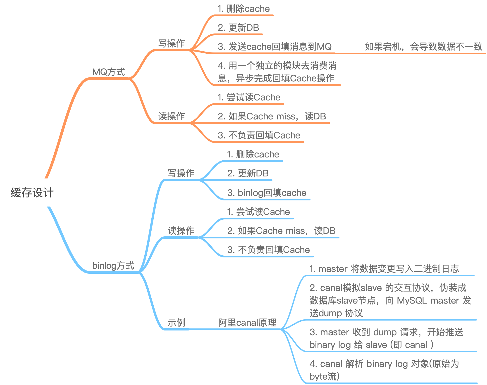
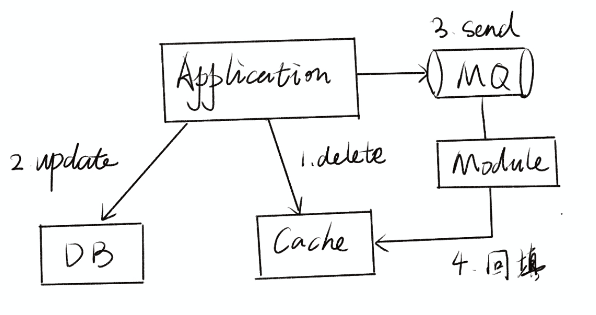
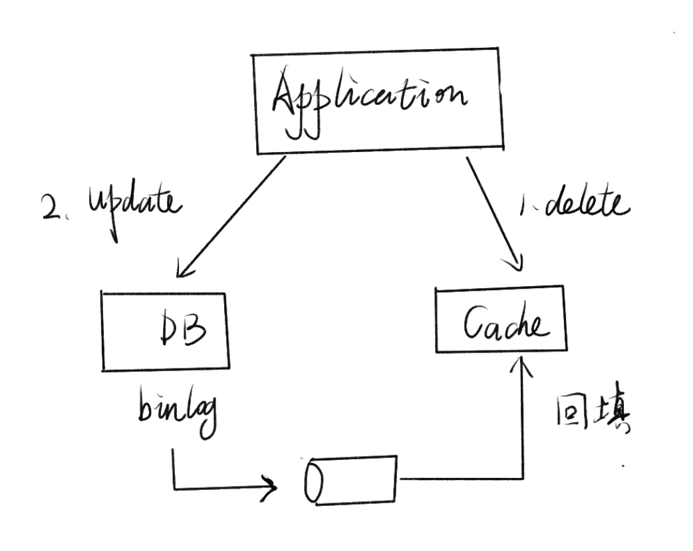

# 缓存设计

<!-- @import "[TOC]" {cmd="toc" depthFrom=2 depthTo=6 orderedList=false} -->
<!-- code_chunk_output -->

* [思维导图](#思维导图)
* [涉及的操作:](#涉及的操作)
* [思路](#思路)
* [实现](#实现)
* [考虑Binlog方式，应该如何设计](#考虑binlog方式应该如何设计)
	* [成熟项目](#成熟项目)
	* [工作原理](#工作原理)
		* [MySQL主备复制原理](#mysql主备复制原理)
		* [canal 工作原理](#canal-工作原理)

<!-- /code_chunk_output -->
## 思维导图

## 涉及的操作:

- 淘汰Cache
- 读Cache
- 回填Cache
- 读DB
- 更新DB

## 思路

将**读操作**和**回填缓存操作**分开，这里只要`回填Cache`发生在`更新DB`之后

## 实现

- 写操作：

  1. 淘汰Cache
  2. 更新DB
  3. 发送Cache回填消息
  4. 用一个独立的模块去消费消息，异步完成回填Cache操作

- 读操作：

  1. 尝试读Cache
  2. 如果Cache miss，尝试读DB，不负责回填Cache

> 考虑DB事务提交之后，Application宕机，第3步消息没有发生出去，也会导致DB和Cache数据不一致

## 考虑Binlog方式，应该如何设计

即写操作第3步，不在Application发送消息了，而是采用Binlog方式，回填Cache

### 成熟项目

[alibaba的canal项目](https://github.com/alibaba/canal)

主要用途是基于 MySQL 数据库增量日志解析，提供增量数据订阅和消费，如下

- 数据库镜像
- 数据库实时备份
- 索引构建和实时维护(拆分异构索引、倒排索引等)
- 业务 cache 刷新
- 带业务逻辑的增量数据处理

### 工作原理

#### MySQL主备复制原理

- MySQL master 将数据变更写入二进制日志( binary log, 其中记录叫做二进制日志事件binary log events，可以通过 show binlog events 进行查看)
- MySQL slave 将 master 的 binary log events 拷贝到它的中继日志(relay log)
- MySQL slave 重放 relay log 中事件，将数据变更反映它自己的数据

#### canal 工作原理

- canal 模拟 MySQL slave 的交互协议，伪装自己为 MySQL slave ，向 MySQL master 发送dump 协议
- MySQL master 收到 dump 请求，开始推送 binary log 给 slave (即 canal )
- canal 解析 binary log 对象(原始为 byte 流)
